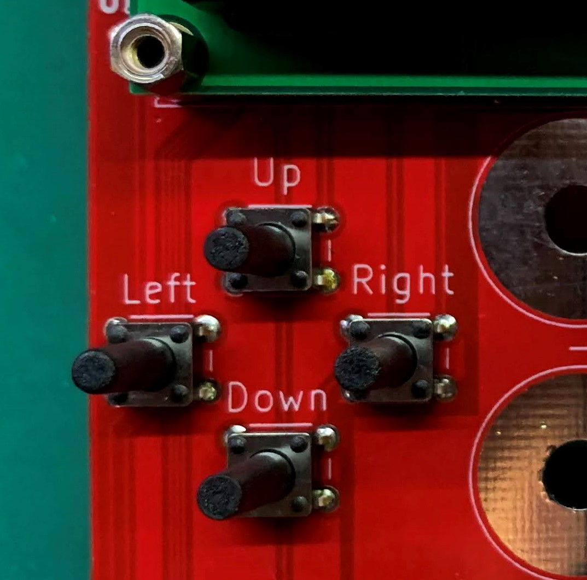

# PowerBrigand

## About

### How can I get it?

Well, you can build one yourself from the source files here, or better yet, you can purchase a kit from my Tindie store below:
[https://www.tindie.com/products/schenktronics/power-brigand/](https://www.tindie.com/products/schenktronics/power-brigand/)

### What is it?

Power Brigand is a module that attaches to HP common slot power supplies that are normally used in servers.  It has connectors and/or binding posts to bring 12v power to your devices.  It also has controls which allow you to turn the power supply on and off, as well as display parameters such as voltage, current, and temperature from the i2c bus on the power supply.

### Why?

After leaving the cryptocurrency mining scene, I had quite a few of these power supplies.  They are plentiful on eBay, and therefore inexpensive.  I felt it wasn't worth my time trying to sell them, and wanted a way to repurpose them.  I was unimpressed with the typical breakout board available from eBay and Aliexpress.

### How?

I found a few resources to start with.  [This one](http://colintd.blogspot.com/2016/10/hacking-hp-common-slot-power-supplies.html) discussed the supply, and compared it to a similar Murata power supply.

The best source of information I found was [this github repo](https://github.com/raplin/DPS-1200FB) where the author, DrTune, reverse engineered a power supply by decompiling the firmware from the internal microcontroller.  DrTune created some sample python code to read and write data to and from the I2C bus.  This gave me information on which registers to query for the data.

Using an arduino nano, a bus pirate, and DrTune's python code as a guide, I was able to successfully read the I2C bus.  This encouraged me to create a PCB with an LCD, output terminals, and fuses.

## Hardware

### Common Slot Power Supply

This is the heart of the Power Brigand, it won't work without one.
There are at least four commonly available versions of these power supplies: 460W, 750W, and two different 1200W versions.

#### 460W

This is the smallest of the power supplies, and the quietest.  Despite its small size, it is capable of producing 38.3A.  My testing has shown that this has the quietest fan, and the most sensitive current measurement capability.

 

#### 750W

This is the middle size power supply.  It can produce 62.5A.  Its fan is noisier than the 460W, and the minimum current it can accurately display is about 5A.

 

#### 1200W

There are two 1200W power supplies, one is higher efficiency than the other.  They are sensitive to the input voltage.  At 120V they can only produce 75A. They require a 200V-240V power source to produce their full capability of 100A.  These power supplies also have a minimum accurate current display of about 5A, and they typically have noisier fans than the others.

 
 

### Power Brigand

The power brigand consists of a main PCB which integrates the edge card connector, fuses, buttons, LED's, LCD, Arduino Nano, and other supporting components.

#### Fused Outputs

There are three 25A fused outputs, for 75A total output capability.  Each fuse has an LED next to it to indicate whether there is voltage after the fuse.  If one of the LED's is not lit, there is a good chance that fuse is blown.  The fuse holders are designed to accommodate standard automotive blade style fuses.

The outputs can be configured with either binding posts, or Anderson powerpole connectors.  A typical configuration would have two sets of powerpole connectors and one pair of binding posts.

#### Power Button

On the lower left, there is a power button.  Press this button once to turn on the outputs.  Hold this button to turn off the outputs.  The LED next to the power button will illuminate when the outputs are commanded to turn on.

#### LCD and navigation buttons

The LCD is where the information is displayed.  There are four push buttons just below the left of the LCD.  If you see an arrow on the display, it indicates you can push one of these four buttons to navigate.  If you see an arrow pointing up, that means you can press the "up" button.  If you see an arrow pointing to the right, that means you can press the "right" button, and so on.

 

#### Arduino Nano

The Arduino Nano compatible module is the "brains" of the unit.  It reads the I2C bus on the power supply, commands it on and off, writes data to the LCD, and handles the buttons.  The software is written and C and can easily be modified using the Arduino IDE.

 

 This work is licensed under a <a rel="license" href="http://creativecommons.org/licenses/by-nc-sa/4.0/">Creative Commons Attribution-NonCommercial-ShareAlike 4.0 International License</a>.
